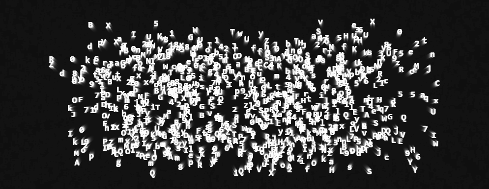

## Hi there 👋
I'm Muhammad Hasan.\
15. Python/Go developer. OSS contributor. CodeJam finalist.

## Notable Personal Projects
- [DNS Resolver](https://github.com/mhaxanali/dns-resolver)
- [Nixscribe](https://github.com/mhaxanali/nixscribe)
- [math-evaluate](https://github.com/mhaxanali/math-evaluate)
- [WebApp Simple Calculator](https://github.com/mhaxanali/webapp-simple-calculator)
- [go-math-eval](https://github.com/mhaxanali/go-math-eval)

## Notable Projects I Collaborated On
- [Tetris-Bugs](https://github.com/mhaxanali/tetris-bugs)  
  👾 *Python Discord CodeJam 2025 Finalist (Top 3) — Team Grand Gardenias*  
  - Contributed **timer logic** and **pause screen** implementation in a browser-based Tetris-style code editor built with **PyScript**.   
  - Collaborated in a cross-functional team to blend **Python**, **TailwindCSS**, and browser scripting for a fully interactive IDE-meets-Tetris experience.  
  - Project theme: *“Wrong Tool for the Job”* — turning Tetris into a functioning **code editor**.

- [Sir Lancebot](https://github.com/python-discord/sir-lancebot)  
  🗡️ *Open Source Contribution:*
  - Added `.quote daily` and `.quote random` commands using the [ZenQuotes.io](https://zenquotes.io/) API.  
  - Improved `.gh repo` command to support aliases, default org and most starred repo fallback.
 
## Featured Projects

### [AI Video Generator](https://github.com/mhaxanali/video-generator)
A modular AI-powered pipeline that orchestrates script generation, image sourcing, TTS, and video clipping.
- Backend: Python orchestration + API integration
- Frontend: Simple HTML/JS for testing/display
- Demonstrates: Full-stack thinking, modular design, devops awareness
- Status: Archived due to API constraints, but showcases architecture and skills

## Reach Me
📧 mhasanali2010@gmail.com\
Discord: [ryushison](https://discord.com/users/764492206513455107)
